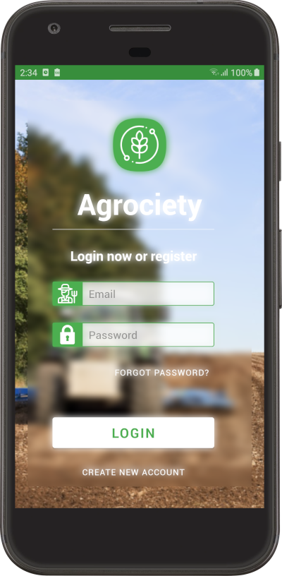
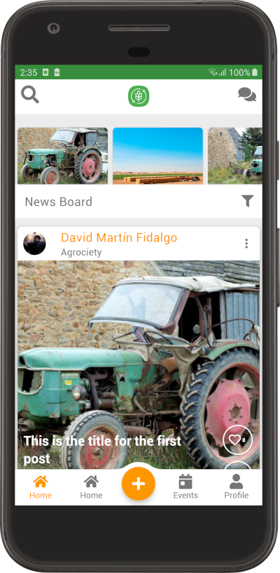
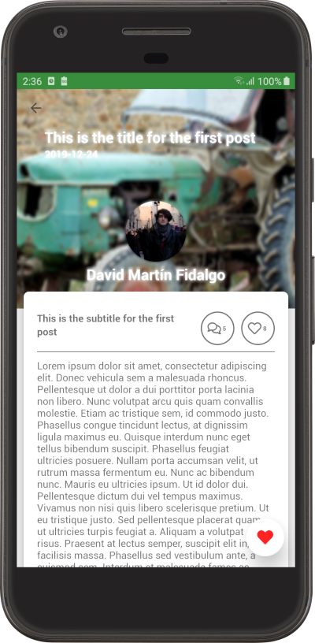
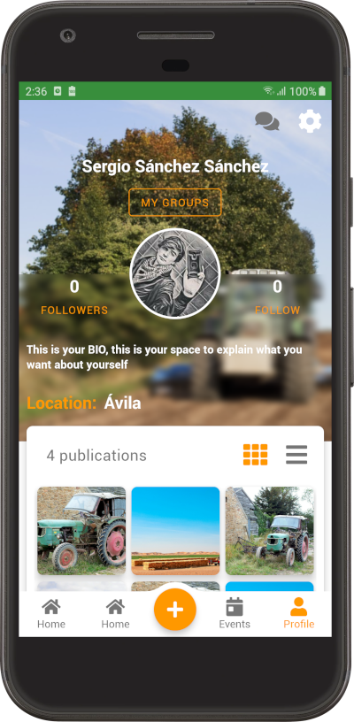

# Agrociety - Prototype of agricultural application to connect the rural world in the demand for services

## Main goals

* Give better access to services.
* Streamline the management of suppliers and consumers.
* Optimize available resources.
* Improve productivity.

## Some Pictures

## Visitors Count

## Please Share & Star the repository to keep me motivated.
  
  

